# Sistema de Gerenciamento de Conteúdo (CMS+)

## Descrição do Projeto

Sistema completo de gerenciamento de conteúdo (frontend e banckend). Trata-se de um sistema onde os usuários podem criar, editar, visualizar e deletar postagens, além de várias funções extras para o administrador. O back-end da aplicação é construído utilizando, principalmente, Node.js, Express e Mongodb. Já o front-end foi feito em React.js e Vite.

> [!WARNING]
> É de extrema importância que o Guia Rápido seja executado corretamente antes da execução do projeto completo 

# Índice

1. [Guia Rápido](#guia-rápido)
2. [Back-end](#back-end)
    - [Instruções de Instalação e Execução](#instruções-de-instalação-e-execução)
    - [Instalação das dependências](#instalação-das-dependências)
    - [Exemplos de Uso - Back-end](#exemplos-de-uso---back-end)
        - [Controles de Usuários](#controles-de-usuários)
        - [Controles de Postagens](#controles-de-postagens)
3. [Front-end](#front-end)
    - [Principais Componentes e Páginas](#principais-componentes-e-páginas)
    - [Estilos e Responsividade](#estilos-e-responsividade)
    - [Funcionalidades](#funcionalidades)
4. [Exemplos Práticos](#exemplos-práticos)
    - [Home](#home)
    - [Cadastro e Login](#cadastro-e-login)
    - [Criar Postagem](#criar-postagem)
    - [Painel de Controle](#painel-de-controle)
    - [Responsividade](#responsividade-1)
5. [Próximos passos](#próximos-passos)
6. [Conclusão](#conclusão)


# Guia Rápido

## Clone do repositório

O back-end e o Front-end estão em uma única pasta no repositório do github.
Você deve seguir os passos para a clonagem e depois separar as pastas como desejar.

> [!IMPORTANT]
> Para bom funcionamento, é importante que tenha instalado Node.js (versão 14, ou superior) e Mongodb (versão 4.4 ou superior).

[Acessar site do Node.js](https://nodejs.org/en)

[Acessar site do Mongodb](https://www.mongodb.com/pt-br/docs/manual/installation/)

1. Clone o repositório:

```bash
git clone https://github.com/Danyel492/cms.git
```
Você irá encontrar duas pastas (Back-end e Front-end), bem como uma terceira contendo alguns prints que serão exibidos ao longo deste documento.

2. Abra a pasta `cms/backend` e execute as linhas de comando:
```bash
npm install
``` 
_|Esse comando irá instalar as dependências necessárias para rodar o back-end_


```bash
npm run seed
```
_|Esse comando cria alguns usuários e postagens no banco de dados_

> [!IMPORTANT]
> A linha de comando acima deve ser executada antes de rodar o servidor.
>
> Isso fará com que o banco de dados seja populado com as postagens e usuários iniciais para o uso em [Exemplos Práticos](#exemplos-práticos).

```bash
npm run dev
```
_|Esse comando irá iniciar o servidor back-end_

O servidor estará rodando, por padrão, na porta 3000. Você pode acessar a API através do endereço `http://localhost:3000`

_|Caso queira alterar a porta, siga os passos descritos em [Instalação das Dependências](#instalação-das-dependências)_


3. Volte e abra a pasta `cms/frontend` e execute:
```bash
npm install
```
_|Esse comando irá instalar as dependências necessárias para rodar o front-end_


```bash
npm run dev
```
_|Esse comando abre um servidor local para rodar o front-end_

Irá abrir um servidor front-end com endereço padrão de [http://localhost:5173](http://localhost:5173)
> [!NOTE]
> Verifique o endereço no terminal

```bash
VITE v6.1.0  ready in 273 ms

  ➜  Local:   http://localhost:5173/
  ➜  Network: use --host to expose
  ➜  press h + enter to show help
```
_|Essa é a mensagem que deve aparecer no terminal após o início do servidor front-end (ou similar)_

Caso a porta esteja sendo usada, irá exibir a próxima porta disponível.

> [!NOTE]
> A partir desse momento, caso queira, pode pular para [Exemplos Práticos](#exemplos-práticos) e começar a utilizar o sistema.

[Voltar ao Índice](#índice)
# Back-end

## Instruções de Instalação e Execução

> [!IMPORTANT]
> Essa etapa seguirá os mesmos passos do Guia Rápido
>
> Caso já tenha feito, pode pular

### Instalação das dependências

1. Abra a pasta `cms/backend` e execute as linhas de comando:
```bash
npm install
``` 
_|Esse comando irá instalar as dependências necessárias para rodar o back-end_


```bash
npm run seed
```
_|Esse comando cria alguns usuários e postagens no banco de dados_

> [!IMPORTANT]
> A linha de comando acima deve ser executada antes de rodar o servidor.
>
> Isso fará com que o banco de dados seja populado com as postagens e usuários iniciais que estão nesse documento para testes práticos.

```bash
npm run dev
```
_|Esse comando irá iniciar o servidor back-end_

O servidor estará rodando, por padrão, na porta 3000. Você pode acessar a API através do endereço `http://localhost:3000`

> [!TIP]
> Para mudar a porta de acesso, navegue até:
> `backend/src/app.js`
>
> Altere a `const PORT = 3000;` e acesse a nova porta.

[Voltar ao Índice](#índice)
### Testes

Para rodar os testes, execute:

```bash
npm test
```


[Voltar ao Índice](#índice)
## Exemplos de uso - Back-end

### Controles de usuários

Todos os controladores das funções inerentes aos usuários estão em  `cms/backend/src/controller/userControllers.js`.

1. Criar um usuário

Endpoint: `POST /user/create`

```bash
curl -X POST http://localhost:3000/user/create \
-H "Content-Type: application/json" \
-d '{
    "username": "testeUsuario",
    "email": "testeusuario@email.com",
    "password": "senha",
    "is_active": true,
    "is_admin": false
}'
```

Os campos `username`, `email` e `password` estão configurados como obrigatórios e o não preenchimento desses campos resultará em um erro.
Além disso, os campos `username` e `email` devem ser únicos no banco de dados (também retornando um erro caso são seja cumprido).

`is_active` e `is_admin` são enviados, por padrão, como true e false, respectivamente. Dessa forma garantido que os novos usuários já serão ativos no ato do cadastro e não serão administradores[^1].


[^1]: Em atualizações futuras, implementar uma função de promoção de usuários, onde um administrador pode diretamente do front-end atualizar o status de algum usuário para administrador, alterando a propriedade `is_admin` para `true`.

Essas configurações são encontradas no caminho `cms/backend/src/models/user.js`

Para criptografar a senha, de forma a não salvar a mesma no banco de dados com os caracteres originais que o usuário criou, foi usado o `bcrypt`. Assim como para comparar a senha salva, ainda sem deixar aparente a senha do usuário.
Tudo isso é possível visualizar no caminho `cms/backend/src/models/user.js`

2. Autenticar um Usuário

Enddpoint: `POST /user/authenticate`

```bash
curl -X POST http://localhost:3000/user/authenticate \
-H "Content-Type: application/json" \
-d '{
    "username": "testeUsuario",
    "password": "senha"
}'
```

A resposta dessa rota, além de autorizado, retorna um token que, por padrão, dura 1 hora e pode ser alterado em `cms/backend/src/controllers/userController.js`. Na função `authenticate` é só encontrar a constante definida como `token` e alterar a propriedade de `expiresIn` para a quantidade de tempo que deseja que o token dure.

3. Listar todos os Usuários

Endpoint: `GET /user/all`
```bash
curl -X GET http://localhost:3000/user/all
```
Possibilita a listagem de todos os usuários cadastrados no banco de dados.


4. Exclusão de um Usuário por ID

Endpoint: ``DELETE /user/delete/:id``

```bash
curl -X DELETE http://localhost:3000/user/delete/{userId}
```
Exclui o usuário com o ID especificado da base de dados. Substitua "{userId}" pelo ID do usuário que você deseja deletar.

5. Encontrar um Usuário por ID

Endpoint: ``GET /user/id/:id``

```bash
curl -X GET http://localhost:3000/user/id/{userId}
```
Retorna os dados do usuário com o ID especificado. Substitua "{userId}" pelo ID do usuário desejado.

6. Ativar/Desativar um Usuário

Endpoint: ``PATCH /user/is_active/:id``

```bash
curl -X PATCH http://localhost:3000/user/is_active/{userId}
```
Alterna o status "ativo" do usuário com o ID especificado. Substitua "{userId}" pelo ID do usuário. Se o usuário estiver ativo, ele será desativado, e vice-versa.
Isso permite bloquear as atividades de um determinado usuário sem a necessidade da exclusão do mesmo.

[Voltar ao Índice](#índice)

### Controles de postagens

1. Criação de uma Nova Postagem

Endpoint: ``POST /post/create``

```bash
curl -X POST http://localhost:3000/post/create -H "Content-Type: application/json" -d '{
  "title": "Título da Postagem",
  "content": "Conteúdo da Postagem",
  "author": "nome_do_autor" 
}'
```
Permite a criação de uma nova postagem no banco de dados com os dados fornecidos no corpo da requisição (título, conteúdo e autor).

Além dos parâmetros passados, ainda é salvo no banco de dados, automaticamente, o dia e a hora da criação da postagem através da propriedade `created_at`, uma segunda data que pode ser atribuída a data de alteração da postagem pela propriedade `changed_at` e uma propriedade para verificar se a postagem está ou não ativa através de `is_active`, enviado por padrão o valor de `true` e podendo ser alterado posteriormente.

2. Exclusão de uma Postagem por ID

Endpoint: ``DELETE /post/delete/:id``

```bash
curl -X DELETE http://localhost:3000/post/delete/{postId} 
```
Exclui a postagem com o ID especificado da base de dados. Substitua "{postId} " pelo ID da postagem que você deseja deletar.

3. Listar Todas as Postagens

Endpoint: ``GET /post/all``

```bash
curl -X GET http://localhost:3000/post/all
```
Possibilita a listagem de todas as postagens cadastradas no banco de dados.

4. Obter uma Postagem por ID

Endpoint: ``GET /post/id/:id``


```bash
curl -X GET http://localhost:3000/post/id/{postId} 
```
Retorna os dados da postagem com o ID especificado. Substitua "{postId} " pelo ID da postagem desejada.

5. Listar Postagens Ativas

Endpoint: ``GET /post/active``


```bash
curl -X GET http://localhost:3000/post/active
```
Retorna todas as postagens que estão marcadas como ativas. Utilizado para exibir as postagens permitidas a todos os usuários.

6. Listar Postagens por Autor

Endpoint: ``GET /post/user/:author``


```bash
curl -X GET http://localhost:3000/post/user/nome_do_autor
```
Retorna todas as postagens criadas pelo autor especificado. Substitua "nome_do_autor" pelo nome do autor desejado.

7. Ativar/Desativar uma Postagem

Endpoint: ``PATCH /post/is_active/:id``


```bash
curl -X PATCH http://localhost:3000/post/is_active/{postId} 
```
Alterna o status "ativo" da postagem com o ID especificado. Substitua "{postId} " pelo ID da postagem. Se a postagem estiver ativa, ela será desativada, e vice-versa.

8. Alterar o Conteúdo de uma Postagem

Enddpoint: ``PATCH /post/change/:id``


```bash
curl -X PATCH http://localhost:3000/post/change/{postId}  -H "Content-Type: application/json" -d '{
  "content": "Novo conteúdo da postagem"
}'
```
Atualiza o conteúdo da postagem com o ID especificado. Substitua "{postId} " pelo ID da postagem e "Novo conteúdo da postagem" pelo novo conteúdo.

9. Atualizar uma Postagem Completa

Endpoint: ``PUT /post/update/:id``


```bash
curl -X PUT http://localhost:3000/post/update/{postId}  -H "Content-Type: application/json" -d '{
  "title": "Novo título da postagem",
  "content": "Novo conteúdo da postagem",
  "author": "novo_nome_do_autor"
}'
```
Atualiza todos os dados da postagem com o ID especificado. Substitua "{postId} " pelo ID da postagem e forneça os novos valores para título, conteúdo e autor.

[Voltar ao Índice](#índice)

# Front-end

O front-end deste projeto é uma aplicação web desenvolvida utilizando ``React``, que oferece uma interface de usuário interativa e responsiva. A aplicação é composta por vários componentes e páginas que permitem aos usuários criar, visualizar, atualizar e excluir postagens, além de gerenciar usuários (para administradores).

[Voltar ao Índice](#índice)
### Principais Componentes e Páginas

### **Header.jsx**

Contém a marca e a navegação principal.

### **Home.jsx**

Página inicial que exibe uma lista de postagens ativas.
Inclui um botão para criar novas postagens, visível apenas para usuários autenticados.
Utiliza o componente Aside para navegação adicional.

### **ControlPanel.jsx**

Painel de controle para administradores e usuários.
Administradores podem ver, ativar/desativar, atualizar e excluir postagens, além de gerenciar usuários.
Inclui uma seção "Lista de Usuários" que pode ser expandida e contraída em telas menores.
Utiliza componentes como Post, UpdatePost, e User.

### **Login.jsx**

Página de login que autentica os usuários.
Exibe um diálogo de erro usando a tag ``dialog`` se a autenticação falhar.

### **Cadastro.jsx**

Página de cadastro para novos usuários.
Exibe um diálogo de erro usando a tag ``dialog`` se o cadastro falhar.

### **NotFound.jsx**

Página exibida caso o usuário digite uma rota inexistente no navegador.

[Voltar ao Índice](#índice)
## Estilos e Responsividade

### CSS:

Utiliza variáveis CSS para cores e estilos consistentes.
Inclui regras de mídia (@media screen) para tornar a aplicação **responsiva**.
Esconde e mostra elementos como o aside e botões de alternância com base no tamanho da tela.

### Responsividade:

O aside é reposicionado em telas menores que ``720px``.
A lista de usuários no ControlPanel pode ser expandida e contraída em telas menores.

[Voltar ao Índice](#índice)
## Funcionalidades

### Autenticação:

Usuários podem fazer login e cadastro.
Utiliza ``localStorage`` para armazenar o ID do usuário autenticado.

### Gerenciamento de Postagens:

Usuários **autenticados** podem criar, visualizar, atualizar e excluir postagens.
Administradores podem ativar/desativar.

### Gerenciamento de Usuários:

Administradores podem visualizar e gerenciar a lista de usuários.
Inclui a funcionalidade de ativar/desativar usuários.

[Voltar ao Índice](#índice)
## Exemplos práticos
### <ins>Home</ins>


O sistema já começa diretamente na página principal. Todos podem acessar as postagens feitas por outros usuários. Mas só poderá fazer alguma postagem caso tenha um cadastro válido e esteja logado.
 _|Pagina inicial do sistema_


>No aside na direita pode encontrar os links para realizar o cadastro e login

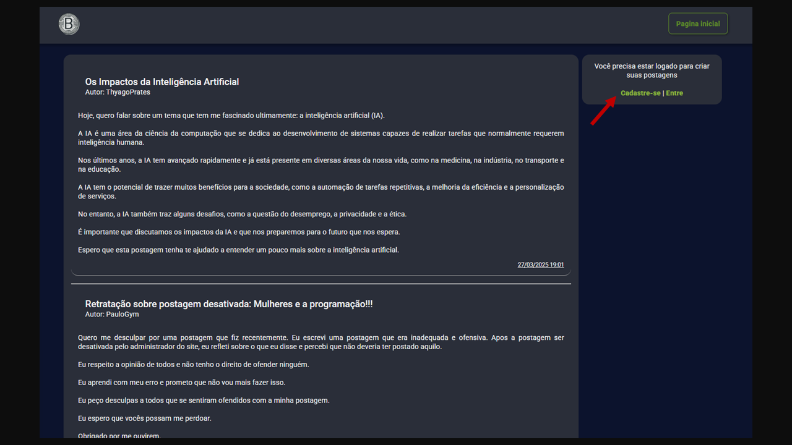 _|Indicação para cadastro e login_
 
### <ins>Cadastro e Login</ins>

Na página de cadastro você irá inserir um `Username`, `email` e `senha`. Se o username ou email **já existir** no banco de dados, um aviso é disparado.
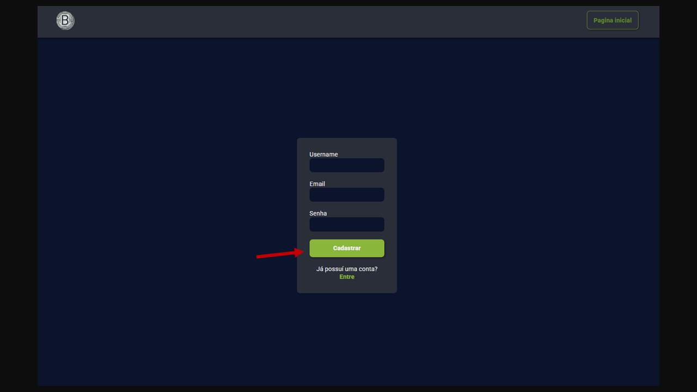 _|Pagina de cadastro de novo usuário_

>Após o cadastro feito você poderá fazer seu primeiro login, inserindo o Username e a senha.

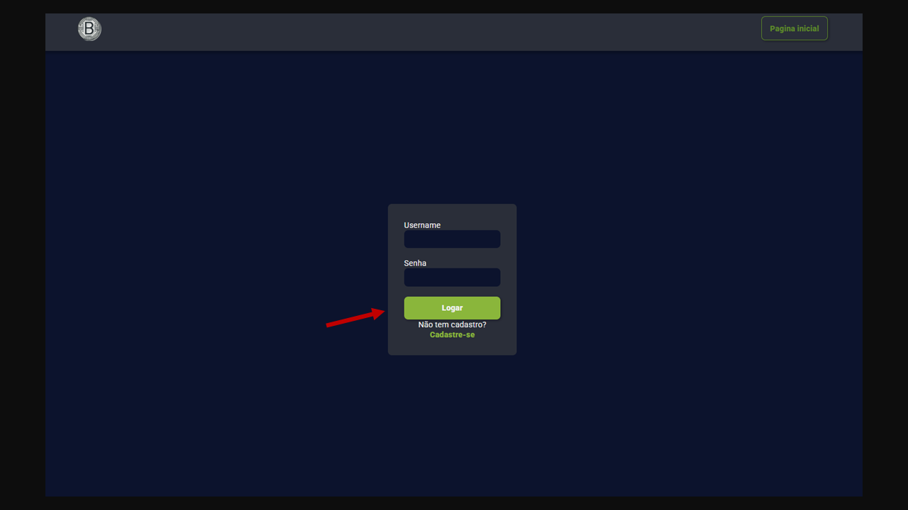 _|Página de login para usuários cadastrados_


>Lista de usuários para testes (recomendo iniciar pelo administrador)
   
| Username  | Password |
| ------------- |:-------------:|
| Danyel492     | admin     |
| PauloGym      | 1234     |
| TroladorMaster      | 1234     |


### <ins>Criar postagem</ins>

Com o login feito com sucesso, você irá retornar para a tela principal e aparecerá um novo botão onde você poderá fazer suas novas postagens.
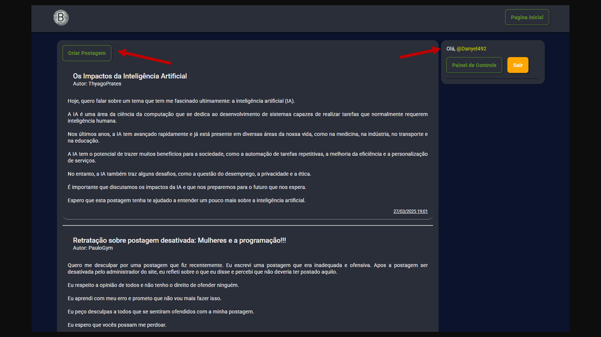 _|Pagina inicial com usuário logado_

O formulário irá esperar como parâmetros um ``título`` da postagem e o ``conteúdo``.

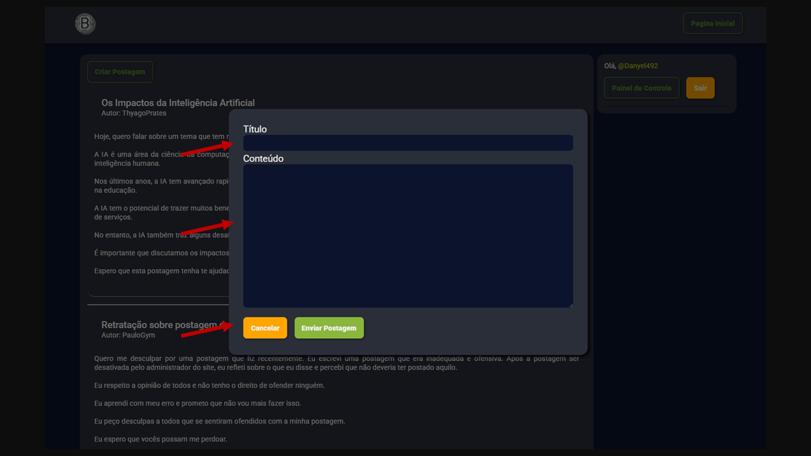 _|Componente de criação de postagem_

Você pode finalizar com o envio da postagem ou o cancelamento do envio. Em ambas as opções você vai voltar para a página principal.

### <ins>Painel de controle</ins>

No aside, no local onde ficava os links para cadastro e login, agora está o nome do usuário logado, um botão para sair e um botão para acessar o painel de controle.
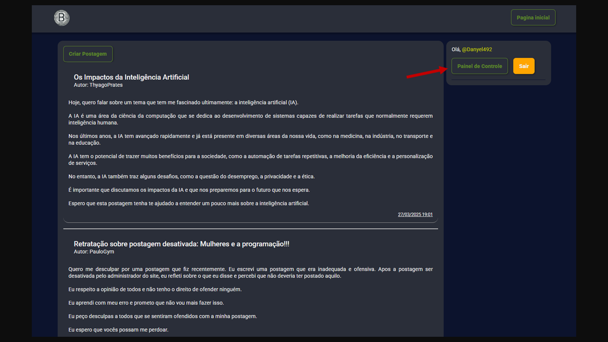 _|Indicação do painel de controle_

Como administrador, você terá acesso a todas as postagens feitas por todos os usuários. Você poderá alterar, excluir ou desativar a postagem desejada.

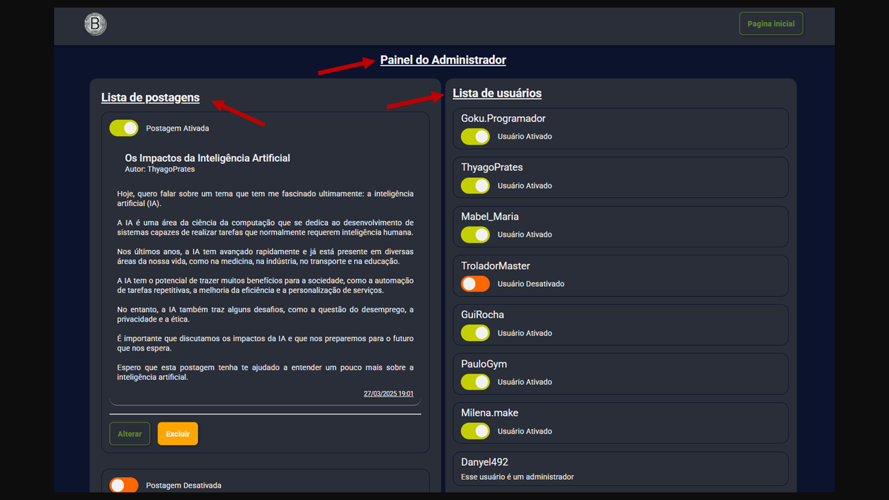 _|Painel de controle (Logado como administrador)_

 - A postagem excluída é eliminada do banco de dados e não vai mais poder ser visualizada no sistema
 - A postagem editada te dá a opção de mudar tanto Título quando conteúdo da postagem
 - Desativar a postagem mantem a postagem no banco de dados, o usuário continuará vendo a própria postagem no seu painel de controle, mas não é possível ver na página principal para os outros usuários.


Ainda no painel de controle do administrador, do lado direito, estão todos os usuários listados para ativar e desativar as atividades do usuário.
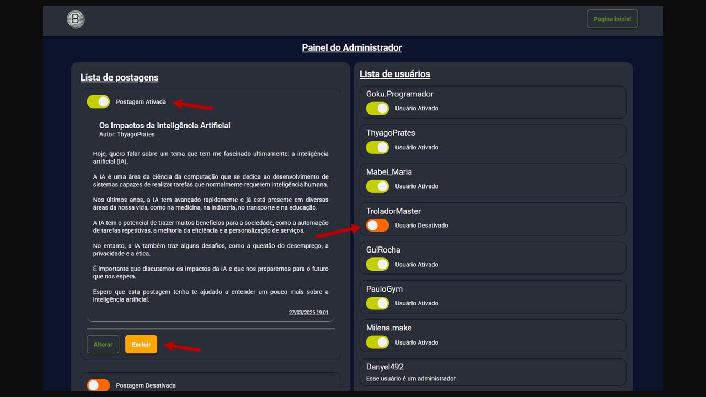 _|Indicação para ativar, desativa e excluir postagem. Indicação para desativar usuário_

No painel de controle do usuário que teve a mensagem desativada, vai aparecer um aviso na mensagem desativada informando isso. (use o usuário PauloGym para ver um exemplo de postagem bloqueada)
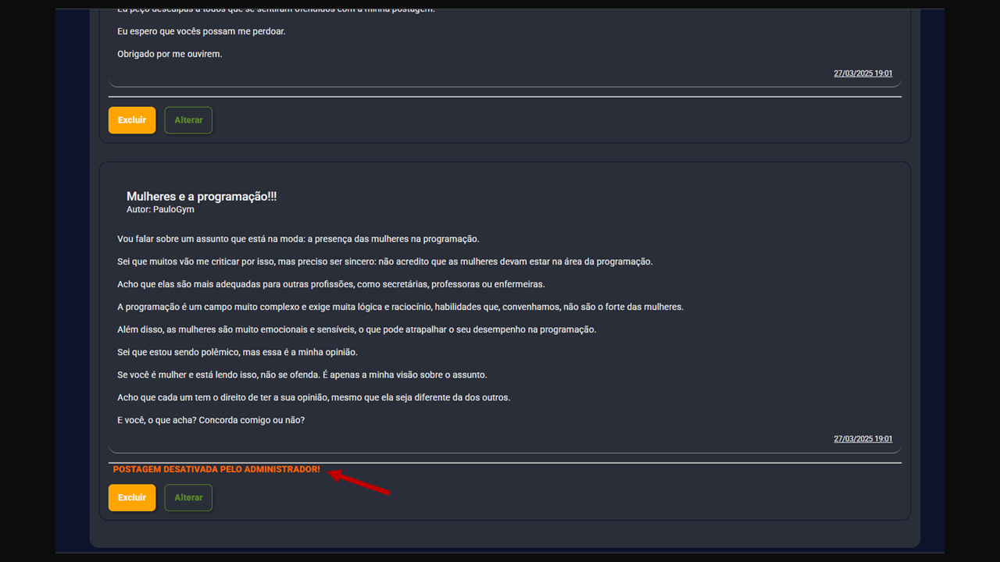 _|Mensagem ofensiva que foi bloqueada pelo administrador_

Já os usuários que tem sua conta desativada, ainda pode visualizar todas as postagens feitas no sistema normalmente. Mas fica impossibilitado de fazer novas postagens. A imagem abaixo mostra um exemplo de um usuário desativado tentando fazer uma nova postagem (Entre no perfil do `TroladorMaster` para ver um exemplo de perfil desativado)

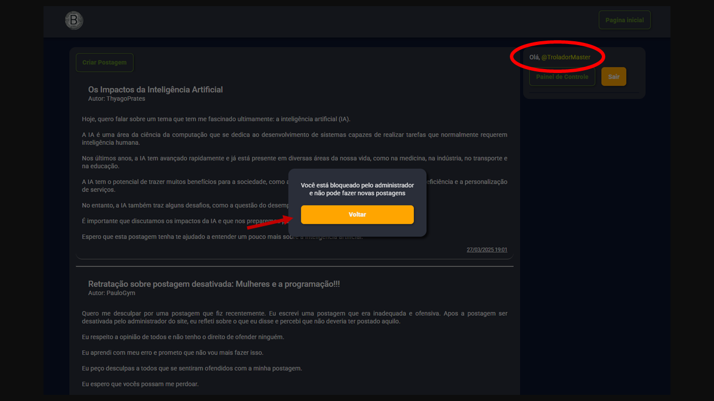 _|Aviso para usuário desativado_

No painel de controle dos usuários, ele pode visualizar todas as suas próprias postagens, editar e excluir elas.
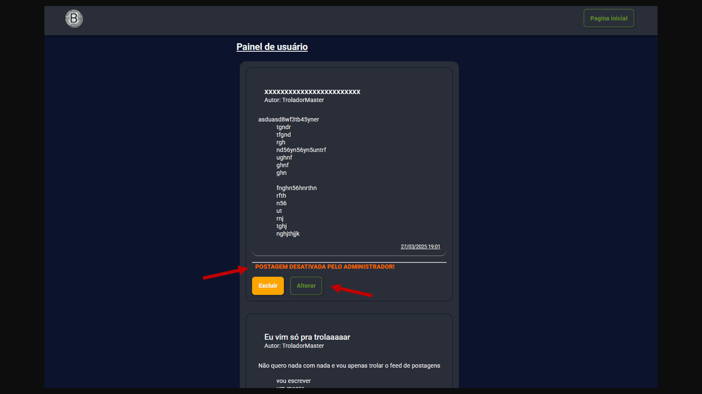 _|Painel de controle do usuário TroladorMaster_

### <ins>Responsividade</ins>

Todas as páginas possuem responsividade para se adaptarem aos celulares. O aside vai para o topo da tela, alinhando todo o conteúdo da página em uma única coluna, como mostra a imagem abaixo.


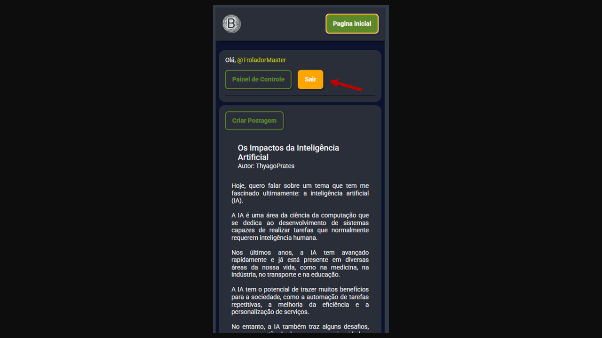

_|Pagina inicial logada por um usuário_

Além disso, os painéis de controle (usuários e administradores), também são responsíveis, com uma pequena mudança no painel dos administradores.
A lista de usuários se contrai dentro de um botão para que a visualização fique mais fluida.


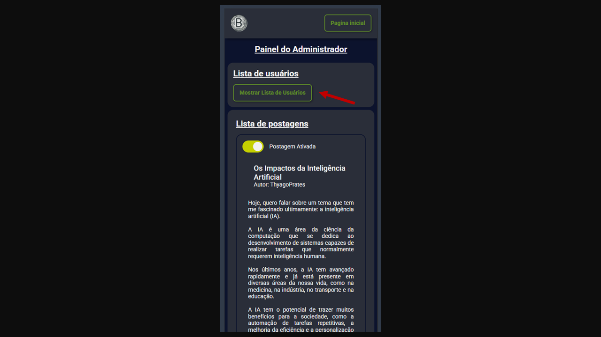 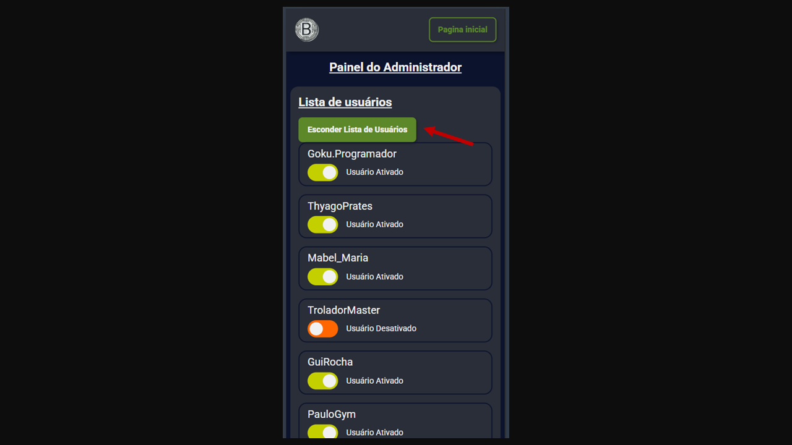

_|Painel de controle do administrador, em um celular_

[Voltar ao Índice](#índice)
## Próximos Passos

Para atualizações futuras pretendo implementar funcionalidades extras, fora do que foi pedido pelo programa.

### <ins>Geral</ins>

1. Aside

    - Exibir as postagens com mais "reações" como: interessante, instrutivo, curioso, etc. Como alternativa ao "like" de redes sociais.
    - Postagens marcadas como favorito pelos usuários para ter acesso rápido a um tópico escolhido por este.

### <ins>Usuários</ins>

1. Informações do Usuários

 - Implementar um campo para exibir mais informações sobre cada usuário como: email, sobre mim, músicas favoritas e hobbies.

2. Solicitação de administrador

 - Usuários podem enviar uma solicitação ao atual administrador para que eles também se tornem administradores.

3. Solicitar reativação de postagem

 - Para usuários que tiveram a postagem desativada, um meio de enviar uma solicitação de revisão da postagem. O usuário pode utilizar a funcionalidade já existente de editar a postagem para que o administrador aprove a alteração, reativando a postagem.
 
4. Escolher Avatar

 - Grandes empresas como Disney, Netflix, Max, possuem um campo de perfil de usuário que ao invés de permitir que enviem suas próprias fotos, possa escolher dentre algumas opções um avatar para ficar em seu perfil. Isso permite um controle maior do que é exibido no sistema, além de economizar em espaço de armazenamento.
 
5. Comentários nas postagens

 - Um campo dedicado a comentários sobre as postagens.
 
6. Solicitação de administrador

 - Usuários podem enviar uma solicitação ao atual administrador para que eles também se tornem administradores.

### <ins>Administradores</ins>


1. Listar administradores

 - Atualmente é possível listar todos os usuários através do painel de controle dos administradores. Junto com os usuários, também são listados os administradores, com um aviso de que não é um usuário comum. Uma lista separada para administradores deixará a aplicação ainda mais legível.

2. Promover usuário

 - Implementar uma slider para promover ou remover o status de administrador de algum usuário.
 
3. Filtragem de palavras

 - Criar um sistema de filtro de palavras chave de forma a automatizar as postagens a serem revisadas pelos administradores.


[Voltar ao Índice](#índice)
## Conclusão

Este projeto representa um esforço significativo na aplicação de conceitos e tecnologias de back-end e frontend. Ao longo do desenvolvimento, foram exploradas diversas funcionalidades, desde a criação e gestão de postagens até a implementação de um sistema de controle de acesso robusto, com diferentes níveis de permissão para usuários e administradores.

A experiência de construção deste projeto permitiu a aplicação de conhecimentos em Node.js, Express e Mongodb, além de aprimorar habilidades em desenvolvimento frontend e design responsivo. A implementação de funcionalidades como cadastro e login de usuários, criação, edição e exclusão de postagens, painel de controle para administração e moderação de conteúdo, e a preocupação com a responsividade para dispositivos móveis, demonstram um entendimento abrangente do ciclo de desenvolvimento de aplicações web.

Apesar dos desafios encontrados ao longo do processo, o projeto foi concluído com sucesso, atingindo os objetivos propostos e entregando um produto funcional e com potencial para ser expandido e aprimorado em futuras iterações. 

Atenciosamente:

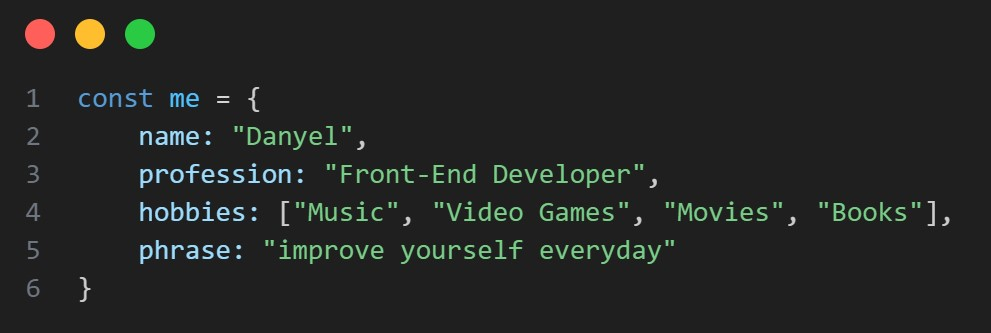
